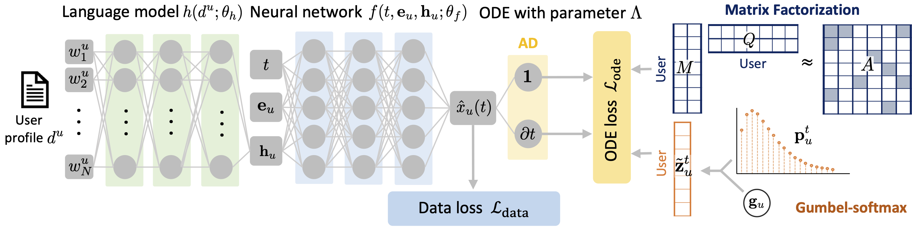

# Sociologically-Informed Neural Network (SINN)

Source code of our KDD 2022 paper: Predicting Opinion Dynamics via Sociologically-Informed Neural Networks [[Link to the paper]()]



## Requirements
* Python 3.9
* numpy==1.19.5
* opencv_python==4.5.2.52
* pandas==1.2.0
* python_dateutil==2.8.2
* pytreebank==0.2.7
* scikit_learn==1.0.2
* scipy==1.6.0
* torch==1.10.0
* torchmetrics==0.5.1
* torchtext==0.11.0
* torchvision==0.9.1
* transformers==4.8.2

## Directory description

- src/: The models are stored here. 

  - voter.py: PyTorch implementation of Voter model. 

  - degroot.py: PyTorch implementation of DeGroot model. 

  - aslm.py: PyTorch implementation of asynchronous linear model (AsLM). 

  - slant.py: PyTorch implementation of a nonlinear generative model for opinion dynamics (SLANT).  

  - slant_plus.py: PyTorch implementation of SLANT+.  

  - nn.py: PyTorch implementation of neural network (NN). 

  - sinn.py: PyTorch implementation of the proposed method, Sociologically-Informed Neural Networks (SINN). 

- working/: The preprocessed datasets are stored here.

  - posts_final_sample_twitter_Abortion.tsv: Dataset of 100 most active users in Twitter Abortion dataset. 

    Each row has the format: `{user_id},{opinion},{time}`.

    `{opinion}` is manually annotated class label.  

    Due to the privacy concern, we removed tweet text. 

  - posts_final_synthetic_consensus.tsv: Synthetic dataset generated using SBCM (stochastic opinion dynamics model) with exponent parameter $\rho=-1.0$.  

  - posts_final_synthetic_clustering.tsv: Synthetic dataset generated using SBCM with exponent parameter $\rho=0.1$.  

  - posts_final_synthetic_polarization.tsv: Synthetic dataset generated using SBCM with exponent parameter $\rho=1.0$.  

    Each row has the format: `{user_id},{opinion},{time}`.


## Data Generation & Collection

### Data generation

We provide synthetic datasets in working/. But you can also generate these datasets. 

- Generate three synthetic datasets

  ```
  python3 simulate.py
  ```

### Data collection

We provide sample real data in working/. But you can also query the dataset via API. 

1. Set your Bearer Token in your environment variable by running the following command in your terminal. 

   ```
   export BEARER_TOKEN='<your-bearer-token>'
   ```

2. Get tweets by query search by running 

   ```
   python3 collect_twitter.py
   ``` 

   Get twitter probiles by username
   ```
   python3 collect_twitter_user.py  
   ```    

   Get Reddit posts 
   ```
   python3 collect_reddit.py
   ```    

### Data preprocessing

- Real-world datasets preprocessing

  ```    
  python3 preprocess.py 
  ```    

- Change data formats 

  ```    
  python3 convert_data.py 
  ```    

## How To Use 

### Example of Usage

- Training: Run ```main_sinn.py``` file to train and evaluate the proposed method with default settings. 
 
  ```
  python3 main_sinn.py 
  ``` 

### Advanced Usage

- To train all models, run the bash shell script 

  ```
  ./run_all_methods.sh
  ```

- To tune hyperparameters in NN and our SINN, run the bash shell script 

  ```
  ./run_grid_search.sh
  ```

- To specify the parameters, run
```
python3 main_sinn.py \
   --method SINN \
   --dataset synthetic_consensus \
   --save_dir output/ \
   --num_hidden_layers 5 \
   --hidden_features 8 \
   --alpha 0.1 \
   --beta 0.1 \
   --num_epochs 500 \
   --lr 0.001 \
   --K 1 \
   --type_odm SBCM
```

  - `method`: str (default=SINN)

     Options are "Voter", "DeGroot", "AsLM", "SLANT", "SLANT+", "NN", "SINN"

  - `dataset`: str (default=synthetic_consensus)

     Options are "synthetic_consensus", "synthetic_clustering", "synthetic_polarization", "sample_twitter_Abortion"

  - `save_dir` specifies the path to save the trained model. The model path defaults to be "./output" if not specified.

  - `num_hidden_layers` specifies the number of layers $L$ in the neural network.

  - `hidden_features` specifies the number of units per layer $N_u$ in the neural network.

  - `alpha` specifies the trade-off hyperparameter $\alpha$. 

  - `beta` specifies the trade-off hyperparameter $\beta$. 

  - `lr` specifies learning rate. 

  - `K` specifies dimension of latent space. 

  - `type_odm` specifies the choice of opinion dynamics model.  

  - `use_profile`: bool (default=False) 

     If True, then use profile descriptions of Twitter users as input of the neural network. 


- To visualize evaluation results, run ```plotting.py``` file.  

  ```
  python3 plotting.py 
  ``` 


## Citation

If you use this code or data, please cite the following paper: 

```
@inproceedings{okawa2022sinn,
  author    = {Okawa, Maya and Iwata, Tomoharu},
  title     = {Predicting Opinion Dynamics via Sociologically-Informed Neural Networks},
  booktitle = {{KDD} '22: The 28th {ACM} {SIGKDD} Conference on Knowledge Discovery and Data Mining},
  pages     = {},
  year      = {2022}
}
```
